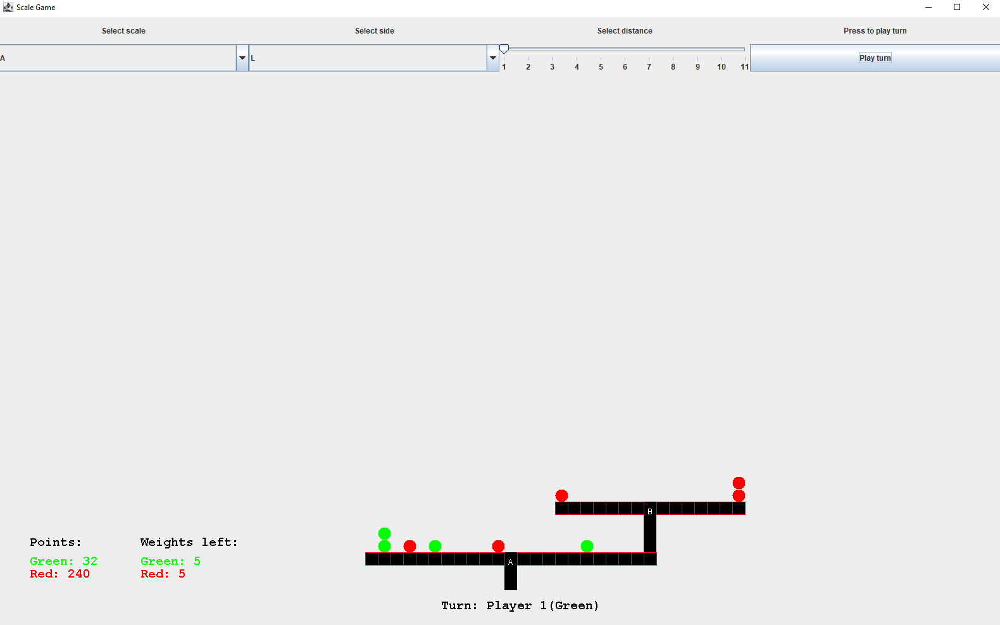
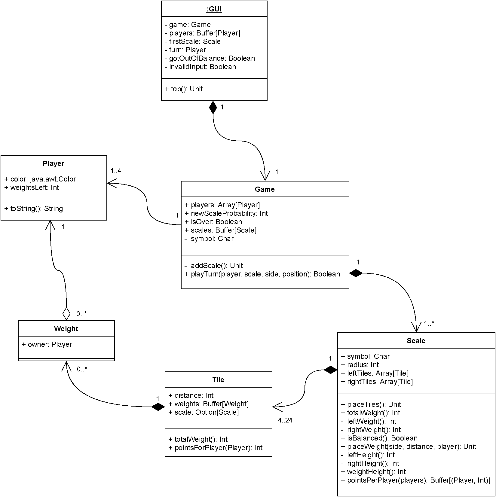

# Scale Game

## Running the app

The app can be launched using the `GUI.scala` file. Requires a scala compiler.

## Description

Scale game is a game built with Scala Swing in which players compete against each other by stacking weights on top of
scales and other weights. The game is turn-based and every players gets to place one weight each
turn. Weights can be placed on any scale and players can choose the exact tile on which they want
to place the weight.

Each player has a predetermined amount of weights which is chosen before the game starts.
Using these weights the players have to collect as many points as possible before they run out of
weights. The player with the most points at the end of the game wins. The game ends when all
players run out of weights.

Each player is differentiated with a color. The possible colors are green, red, orange and blue.
Players’ weights are also colored using that color to separate them.

Points are determined based on how far from the scale’s center the particular weight is. For
example, a weight that is on a distance of 3 tiles from the center, grants the owner of that weight 3
points. Weights can also be stacked. If a player stacks a weight on top of other weights, that player
is given the ownership of the weights that are below that weight and therefore also the points that
those weights yield.

If a weight is on the right side of a scale on a distance of 3 from the scale’s center, that weight
also weighs down the right side by 3. The allowed imbalance before a scale tips over is equal to the
scale’s radius. So for a scale with a radius of 5, the maximum allowed imbalance is 5. If a player
tries to place a weight somewhere that would cause a scale to tip over, the scale is not lost, but the
player loses the weight and the turn is passed to the next person in line.

Scales can also be stacked on top of each other. At the end of each round there is a chance that
a new scale will be placed on top of an existing scale. That chance is chosen by the players before
the start of the game. Points given by weights that are on top other scales are multiplied by the
distance of that scale relative to the lower scales center. So if a scale is on a distance of 2 from
another scale’s center. All points on the upper scale are multiplied by 2. If a tile has a scale on it,
weights can’t be placed on that tile.

|  |
|:--:|
| <b>An example of what a 2 player game could look like after both players have played half of their moves</b>|

|  |
|:--:|
| <b>UML diagram of the application</b>|

